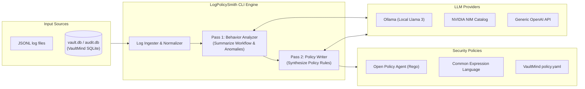

# 🛡️ LogPolicySmith

> **From Agent Behavior to Enforceable Policy — Automatically.**

LogPolicySmith is an offline-first, cloud-extensible policy-as-code generator. It ingests execution logs from AI coding agents (such as VaultMind audit trails or standard JSONL logs), aggregates actions/anomalies, and automatically synthesizes security policies using local LLMs (Ollama) or cloud providers (NVIDIA NIM, DeepSeek, OpenAI).

---

## ❓ Why LogPolicySmith?

Security teams in regulated industries (finance, defense, healthcare) are blocked from using AI coding agents because they cannot verify what files, processes, or networks an agent will access. 

**LogPolicySmith** bridges this gap:
1. It records and aggregates actual agent tool-use patterns.
2. It uses an LLM to extract typical behavior workflows vs. risky actions.
3. It generates ready-to-enforce rules in standard formats (**OPA Rego**, **Google CEL**, or native **VaultMind YAML**).



---

## ✨ Features

*   **Offline-First & Local-First**: Fully compatible with local **Ollama** model servers (defaults to `llama3.2:3b`) for strict air-gapped environments.
*   **Extensible Cloud Providers**: Out-of-the-box support for the **NVIDIA API Catalog** (targeting `meta/llama-3.1-70b-instruct`) and any generic **OpenAI-compatible** endpoints (DeepSeek, Groq, Together AI, etc.).
*   **VaultMind Native Alignment**: Supports parsing VaultMind SQLite logs directly via `--db-path`, and formats rules into VaultMind's custom `policy.yaml` pattern language.
*   **Multi-Engine Targets**: Compile logs to OPA Rego rules, Google CEL expressions, standard YAML structures, or VaultMind policies.

---

## 🚀 Getting Started

### 1. Installation

Install the package in editable mode from the source directory:

```bash
# Clone the repository
git clone https://github.com/ik123a/logpolicysmith.git
cd logpolicysmith

# Set up virtual environment
python -m venv venv
source venv/bin/activate  # or venv\Scripts\activate on Windows

# Install in editable mode with dependencies
pip install -e .
```

### 2. Configure default provider settings

Create or modify `config/default.yaml` in the project root:

```yaml
# config/default.yaml
llm:
  provider: "ollama"                         # Choice: "ollama", "nvidia", or "openai"
  model: "llama3.2:3b"
  ollama_host: "http://localhost:11434"
  nvidia_model: "meta/llama-3.1-70b-instruct"
  nvidia_base_url: "https://integrate.api.nvidia.com/v1"
  openai_model: "gpt-4o"
  openai_base_url: "https://api.openai.com/v1"

policy:
  default_format: "rego"                     # Choice: "rego", "cel", "yaml", "vaultmind"
```

---

## 💻 CLI Usage

The package installs a global executable command `logpolicysmith`.

### Basic Generation (Local Ollama)
```bash
# Ingest local JSONL logs and generate OPA Rego policies
logpolicysmith generate --input audit.jsonl --format rego
```

### Direct VaultMind Integration
```bash
# Query the local VaultMind SQLite database (vault.db) and generate VaultMind YAML rules
logpolicysmith generate --vaultmind --db-path ~/.vaultmind/vault.db --format vaultmind
```

### Cloud Provider (NVIDIA API Catalog)
```bash
# Run using NVIDIA cloud API key
export NVIDIA_API_KEY="your-nvapi-key"
logpolicysmith generate --input audit.jsonl --format rego --provider nvidia
```

### Generic OpenAI-Compatible Endpoints (DeepSeek, Groq, OpenRouter)
```bash
# Run using generic OpenAI-compatible provider
logpolicysmith generate --input audit.jsonl --format rego \
  --provider openai \
  --api-key "your-api-key" \
  --host "https://api.deepseek.com/v1" \
  --model "deepseek-chat"
```

### Dry-Run / Offline Validation
```bash
# Run in mock mode to verify format outputs without invoking an LLM
logpolicysmith generate --input tests/resources/sample_logs.jsonl --format vaultmind --mock
```

---

## 🛠️ CLI Options Reference

| Option | Shortcut | Type / Choice | Default | Description |
|---|---|---|---|---|
| `--input` | `-i` | Filepath | None | Path to raw JSONL log file to ingest |
| `--vaultmind` | `-v` | Flag | False | Flag to query SQLite database audit trail |
| `--db-path` | None | Filepath | None | File path override for VaultMind SQLite database |
| `--days` | `-d` | Integer | 7 | Days of logs to query from SQLite database |
| `--format` | `-f` | `rego`, `cel`, `yaml`, `vaultmind` | Config default | Policy format output engine target |
| `--provider` | `-p` | `ollama`, `nvidia`, `openai` | Config default | LLM execution provider |
| `--model` | `-m` | String | Config default | Override LLM model name |
| `--host` | `-h` | URL String | Config default | Override LLM provider endpoint URL |
| `--api-key` | `-k` | String | None | Override cloud provider API Key |
| `--mock` | None | Flag | False | Dry-run mock execution for validation |

---

## 🔌 Integrating into VaultMind CLI

You can call LogPolicySmith from your Node.js/TypeScript-based VaultMind codebase using a subprocess hook inside your TypeScript files:

```typescript
import { exec } from 'child_process';
import * as fs from 'fs';

export function runPolicySmith(sqliteDbPath: string, outputPath: string) {
  const cmd = `logpolicysmith generate --vaultmind --db-path "${sqliteDbPath}" --format vaultmind --provider nvidia`;
  
  exec(cmd, (error, stdout, stderr) => {
    if (error) {
      console.error(`Subprocess error: ${error.message}`);
      return;
    }
    
    // Parse out YAML lines and write to target configuration file
    const yamlOutput = parseYamlFromConsole(stdout);
    fs.writeFileSync(outputPath, yamlOutput);
    console.log(`VaultMind Policy successfully updated at ${outputPath}`);
  });
}

function parseYamlFromConsole(output: string): string {
  return output.split('\n')
               .filter(line => line.startsWith('|'))
               .map(line => line.slice(1, -1).trimEnd())
               .join('\n');
}
```

---

## 📜 License

This project is licensed under the Apache 2.0 License - see the [LICENSE](LICENSE) file for details.
